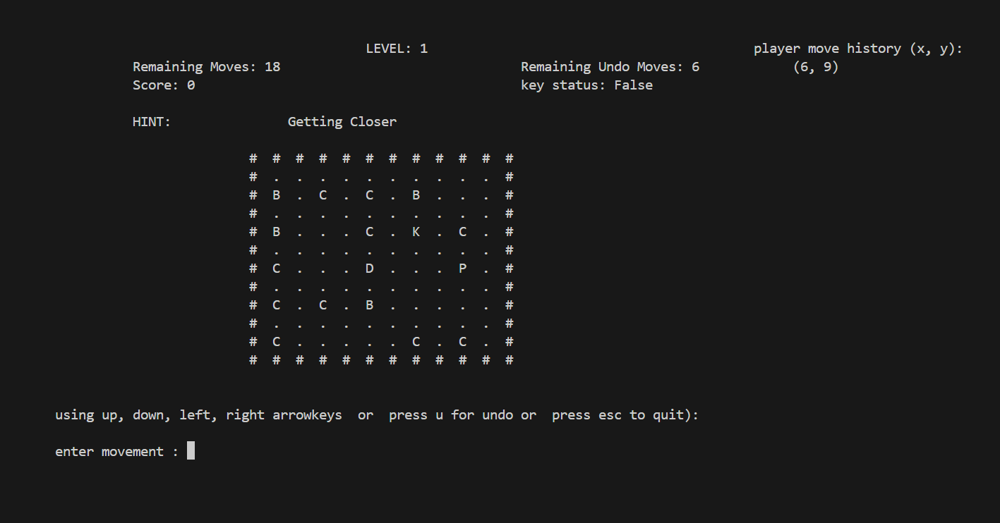
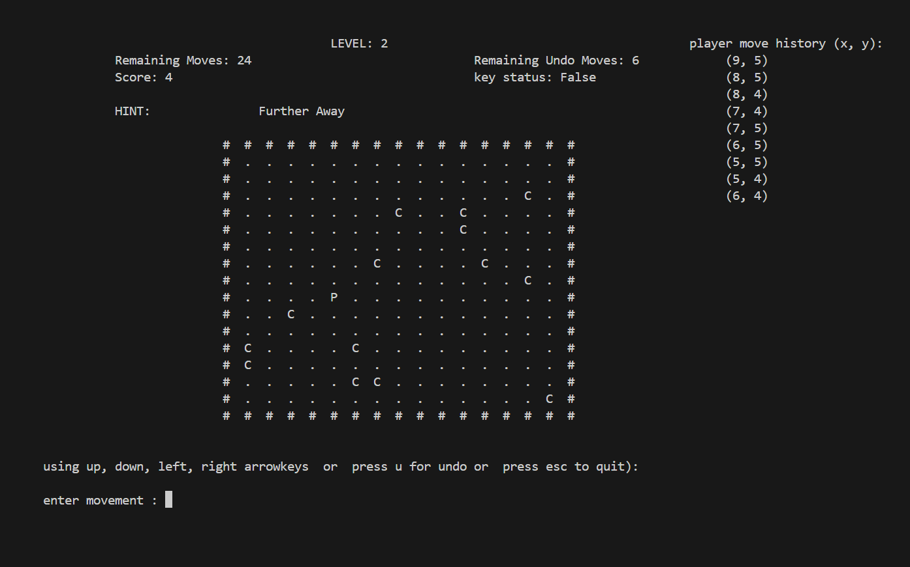
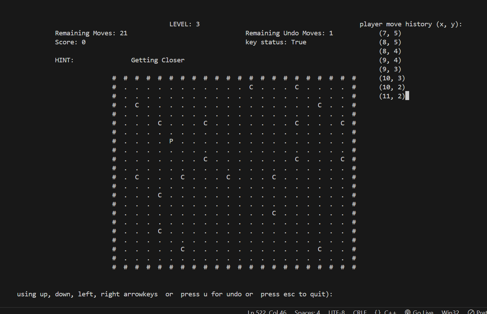

# Maze of Whispers

Author: Ramalah Amir

# Introduction

**Trapped in a dark maze, you must find a hidden key and unlock the exit. You can’t see the key or the door, but you can sense if you're getting closer to the key using your unique ability. Can you find your way out before it's too late?**

## Table of Contents

1. [Game Description](#game-description)
2. [Features](#features)
3. [Installation](#installation)
4. [How to Play](#how-to-play)
5. [Difficulty Levels](#difficulty-levels)
6. [Controls](#controls)
7. [Scoring](#scoring)
8. [Game Over](#game-over)

## Game Description

In this 2D maze game, the player must navigate through a randomly generated maze, find a hidden key, and unlock the exit door to escape. The player can only see the maze's boundaries and their immediate position. Using a sensing ability based on the Manhattan Distance, the player receives hints about whether they are getting closer or further from the hidden key.

Along the way, they can collect coins to gain extra undo moves. The player must be cautious, as stepping on a bomb results in instant game over.

## Features

- **Multidimensional Linked List Grid**: Each cell in the maze is connected to its adjacent cells (up, down, left, right).
- **Randomized Gameplay**: The player, key, door, coins, and bomb are placed randomly each time the game starts.
- **Movement Restrictions**: The player can only undo moves a limited number of times, depending on the difficulty level.
- **Hint System**: The player can sense if they are getting closer or further from the hidden key.
- **Undo Feature**: Allows limited backtracking of moves.
- **Difficulty Levels**: Three levels (Easy, Medium, Hard) that adjust the grid size, number of moves, and available undo actions.
- **Inventory System**: Players can collect coins that grant extra undo moves.
- **Score System**: The final score is based on remaining moves and collected coins.

## Installation

- Clone the repository:
  git clone https://github.com/ramalahamir/assignment_02.git

- usage of library curses.h

## How to Play

- The game starts with the player placed in a dark maze.
- The key and door are hidden, and the player can only sense their proximity to the key.
- Use the sensing ability to guide your movement and find the key before moves runs out.
- Collect coins for extra undo moves, but avoid stepping on bombs!

## Difficulty Levels

1. **Easy**:
   - 10x10 grid
   - 6 extra moves
   - 6 undo moves
2. **Medium**:
   - 15x15 grid
   - 2 extra moves
   - 4 undo moves
3. **Hard**:
   - 20x20 grid
   - No extra moves
   - 1 undo move

## Controls

- **Up**: Move up
- **Down**: Move down
- **Left**: Move left
- **Right**: Move right
- **Undo**: Use the undo feature to go back to your last position (limited by the number of undo moves available).
- **Exit**: Exit the game at any time.

## Scoring

- Each remaining move at the end of the game contributes **1 point**.
- Each collected coin contributes **2 points** and grants an extra undo move.
- The total score will be calculated based on remaining moves and collected coins.

## Game Over

The game will end under the following conditions:

1. **Win**: The player finds the key and unlocks the exit door within the allowed number of moves.
2. **Lose (Bomb)**: The player steps on a bomb.
3. **Lose (No Moves Left)**: The player runs out of moves without reaching the exit.

At game over, the player’s score will be displayed, along with the positions of the collected coins and the key/door locations.

## Assumptions Made:

1. The project assumes full control over the PDCurses library, which is the only external library used.
2. All other functionality, such as the random number generation, has been implemented manually without using built-in libraries.
3. Static and global variables/functions are assumed to be allowed but have not been used in this implementation.

## Sample Outputs:

